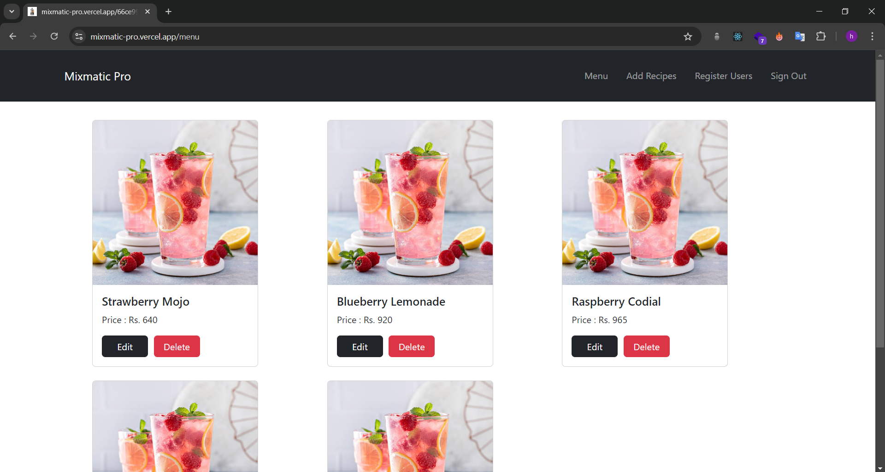
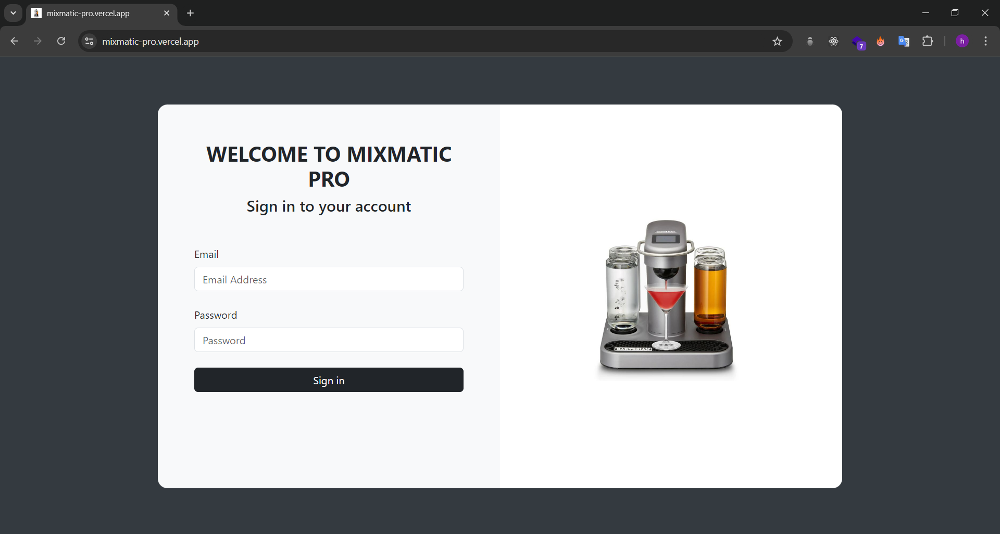
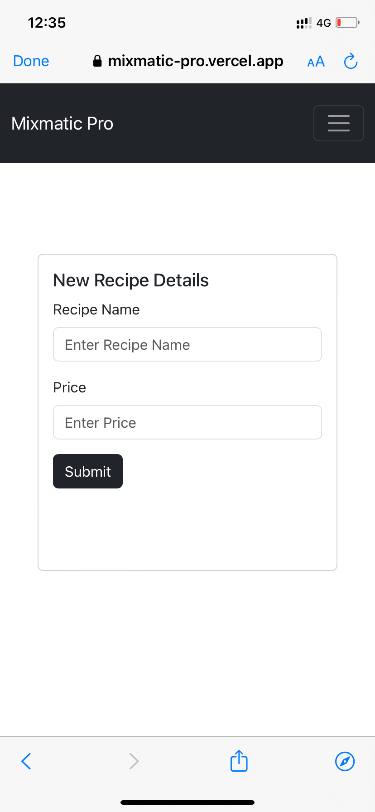
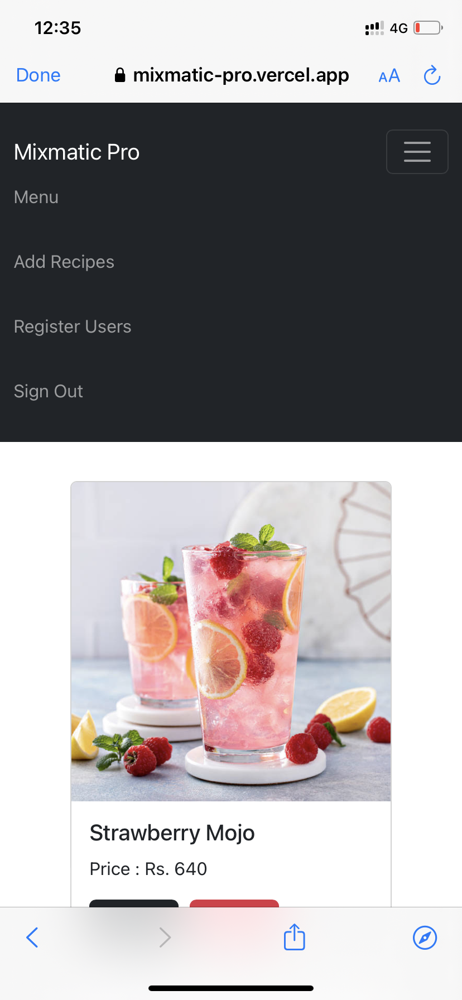

# Mix Matic Web App

Mix Matic Web App is designed to connect and communicate with the Mixmatic Pro IoT device (an automated mocktail maker). It facilitates authenticated users in adding, removing, and updating different mocktail recipes and their prices. Changes made via this web app are instantly reflected in the IoT device.

## Screenshots

### Desktop View

### Mobile View

  
  

## Technologies Used

- **Frontend:**
  - Next.js
  - Bootstrap
  - Vanilla css

- **Backend:**
  - Next.js

- **Database:**
  - MongoDB

- **Authentication:**
  - NextAuth.js

## Live Version

Check out the live version [here](https://mixmatic-pro.vercel.app/).

Use the following credentials to sign in:
- **Email:** test@email.com
- **Password:** 1234
